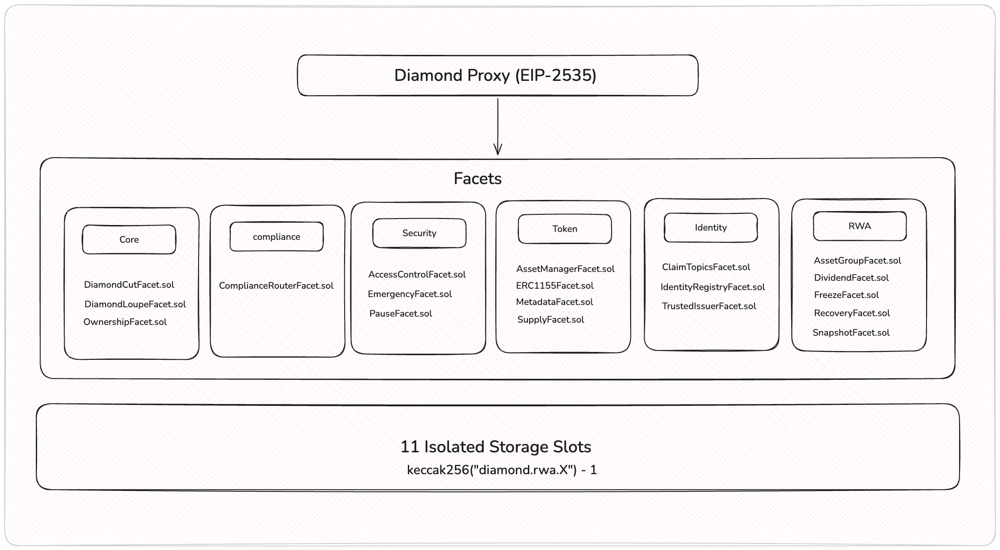

# Diamond ERC-3643

ERC-3643 security tokens for Real World Assets, built on the EIP-2535 Diamond Proxy with ERC-1155 multi-token support.

A single Diamond contract manages multiple regulated asset classes — each `tokenId` carries its own compliance rules, identity requirements, and supply controls. Designed for debt securities, fractional real estate, tokenized commodities, and any RWA that requires on-chain KYC/AML enforcement.

## Architecture



### Standards

| Standard | Role |
|----------|------|
| **ERC-3643 (T-REX)** | On-chain compliance: KYC/AML identity, jurisdiction restrictions, freeze, recovery |
| **EIP-2535 Diamond** | Modular upgradeability via facets; bypasses the 24 KB contract size limit |
| **ERC-1155 Multi-Token** | Multiple asset classes (`tokenId` = asset class) in a single contract |

### Three-Level Regulatory Model

```
Global              ──  Diamond ownership, global pause, RBAC, identity registry
  └─ Per tokenId    ──  compliance module, identity profile, supply cap, allowed countries
       └─ Per holder ── balance partitions (free/locked/custody), freeze, lockup
```

## Facets (19 total)

### Core (3)

| Facet | Purpose |
|-------|---------|
| `DiamondCutFacet` | Add, replace, or remove facets |
| `DiamondLoupeFacet` | Introspection + ERC-165 support |
| `OwnershipFacet` | Ownable2Step ownership transfer |

### Security (3)

| Facet | Purpose |
|-------|---------|
| `AccessControlFacet` | Role-based access control (ISSUER, COMPLIANCE_ADMIN, TRANSFER_AGENT) |
| `PauseFacet` | Global pause + per-asset pause |
| `EmergencyFacet` | Circuit breaker for emergency shutdown |

### Token — ERC-1155 (4)

| Facet | Purpose |
|-------|---------|
| `AssetManagerFacet` | Register and configure asset classes per `tokenId` |
| `ERC1155Facet` | Compliant transfers and balance queries |
| `SupplyFacet` | Mint, burn, forced transfer |
| `MetadataFacet` | Name, symbol, URI per `tokenId` |

### Identity — KYC/AML (3)

| Facet | Purpose |
|-------|---------|
| `IdentityRegistryFacet` | Bind wallets to ONCHAINID + country code |
| `ClaimTopicsFacet` | Define required KYC claim topics per identity profile |
| `TrustedIssuerFacet` | Manage authorized claim issuers |

### Compliance (1)

| Facet | Purpose |
|-------|---------|
| `ComplianceRouterFacet` | Route `canTransfer()` to the compliance module assigned to each `tokenId` |

### RWA Operations (5)

| Facet | Purpose |
|-------|---------|
| `AssetGroupFacet` | Hierarchical asset groups with lazy minting (e.g., building → apartments) |
| `FreezeFacet` | Freeze wallets globally, per asset, or partial amounts; lockup with expiry |
| `RecoveryFacet` | Wallet recovery and balance migration |
| `SnapshotFacet` | Point-in-time balance snapshots |
| `DividendFacet` | Pro-rata dividend distribution linked to snapshots |

### Compliance Modules (pluggable)

| Module | Description |
|--------|-------------|
| `CountryRestrictModule` | ISO-3166 country-based transfer restrictions |
| `MaxBalanceModule` | Maximum token balance per holder |
| `MaxHoldersModule` | Cap on number of unique holders per asset |

## Transfer Flow

Every `safeTransferFrom` passes through 6 validation stages before execution:

```
safeTransferFrom(from, to, tokenId, amount)
  │
  ├─ 1. Protocol paused?           → revert ProtocolPaused
  ├─ 2. Wallet frozen (global)?    → revert WalletFrozenGlobal
  ├─ 3. Asset registered & active? → revert AssetNotRegistered / AssetPaused
  ├─ 4. Wallet frozen (asset)?     → revert WalletFrozenAsset / LockupActive
  ├─ 5. Sufficient free balance?   → revert InsufficientFreeBalance
  ├─ 6. Compliance module check    → revert ComplianceCheckFailed
  │
  ├─ Execute: update balances + holder tracking
  └─ Post-hook: module.transferred() for state updates
```

## Asset Groups & Lazy Minting

The `AssetGroupFacet` enables hierarchical tokenization — a parent asset (e.g., a building) can have child assets (e.g., individual apartments) that are only minted on-chain when sold:

```
createGroup(parentTokenId: 1, name: "Aurora Apartments", maxUnits: 100)
  → groupId: 1                                              ~215k gas

mintUnit(groupId: 1, investor: Alice, fractions: 500)
  → childTokenId: (1 << 128) | 1  →  "Apt 101"            ~600k gas
  → inherits parent's compliance, identity profile, issuer, countries
```

Child tokens that haven't been sold don't exist on-chain — zero gas cost until minted.

## Storage

11 isolated storage namespaces prevent slot collisions during upgrades:

| Library | Domain |
|---------|--------|
| `LibAppStorage` | Owner, pending owner, global pause, protocol version |
| `LibAssetStorage` | Asset configs per `tokenId` (name, symbol, supply cap, compliance module) |
| `LibERC1155Storage` | Balance partitions (free/locked/custody/pending), operator approvals |
| `LibSupplyStorage` | Total supply, holder count, holder tracking per `tokenId` |
| `LibFreezeStorage` | Global freeze, asset freeze, frozen amounts, lockup expiry |
| `LibAccessStorage` | Role mappings and role admin configuration |
| `LibIdentityStorage` | Wallet-to-identity bindings, identity profiles, verification cache |
| `LibComplianceStorage` | Token-to-module mappings, registered modules |
| `LibSnapshotStorage` | Snapshot data with balance captures |
| `LibDividendStorage` | Dividend records with claim tracking |
| `LibAssetGroupStorage` | Group configs, parent-child relationships |

Each slot is derived from `keccak256("diamond.rwa.<domain>.storage") - 1`.

## Project Structure

```
diamond-erc3643/
├── packages/
│   ├── contracts/                    # Solidity (Foundry)
│   │   ├── src/
│   │   │   ├── Diamond.sol           # EIP-2535 proxy
│   │   │   ├── facets/               # 19 facets by domain
│   │   │   │   ├── core/
│   │   │   │   ├── token/
│   │   │   │   ├── identity/
│   │   │   │   ├── compliance/
│   │   │   │   ├── rwa/
│   │   │   │   └── security/
│   │   │   ├── compliance/modules/   # Pluggable compliance modules
│   │   │   ├── interfaces/           # Domain-organized interfaces
│   │   │   ├── libraries/            # LibDiamond, LibAppStorage, LibReasonCodes
│   │   │   ├── storage/              # 11 namespaced storage libraries
│   │   │   └── initializers/         # DiamondInit
│   │   ├── test/
│   │   │   ├── unit/                 # 26 test files (1:1 with facets + modules)
│   │   │   ├── fuzz/                 # Property-based fuzz tests
│   │   │   ├── invariant/            # FREI-PI pattern invariant tests
│   │   │   ├── echidna/              # Echidna property-based fuzzing
│   │   │   └── helpers/              # DiamondHelper, MockComplianceModule
│   │   ├── script/                   # Deploy.s.sol, ConfigureAsset.s.sol
│   │   ├── foundry.toml
│   │   ├── remappings.txt
│   │   └── Makefile
│   ├── indexer/                      # Go blockchain event indexer
│   ├── app/                          # React 19 + Wagmi + RainbowKit frontend
│   └── tools/                        # Developer utilities
├── docs/
│   ├── architecture.md               # Detailed architecture specification
│   └── diagrams/                     # Mermaid diagrams (EN + PT)
│       ├── en/                       # 9 diagrams in English
│       ├── pt/                       # 9 diagrams in Portuguese
│       └── viewer.html               # Interactive diagram viewer
├── .github/workflows/ci.yml          # CI pipeline (7 parallel jobs)
├── turbo.json
├── pnpm-workspace.yaml
└── package.json
```

## Deployments

### Polygon Amoy Testnet (Chain ID: 80002)

| Contract | Address | Verified |
|----------|---------|----------|
| **Diamond (Proxy)** | [`0xAb07CEf1BEeDBb30F5795418c79879794b31C521`](https://amoy.polygonscan.com/address/0xAb07CEf1BEeDBb30F5795418c79879794b31C521) | ✅ |
| DiamondCutFacet | [`0x499b99F9516be8a363c7923e57d8dab2E63fC0D9`](https://amoy.polygonscan.com/address/0x499b99F9516be8a363c7923e57d8dab2E63fC0D9) | ✅ |
| DiamondLoupeFacet | [`0x92Da52B23380A68f4565cD3f5aECAb31FC56eff1`](https://amoy.polygonscan.com/address/0x92Da52B23380A68f4565cD3f5aECAb31FC56eff1) | ✅ |
| OwnershipFacet | [`0x97CBfcF2662c81fa93EcdC1A6e82045980061427`](https://amoy.polygonscan.com/address/0x97CBfcF2662c81fa93EcdC1A6e82045980061427) | ✅ |
| AccessControlFacet | [`0xD097fe5983a52e9e28a504375285e8Ca124C880B`](https://amoy.polygonscan.com/address/0xD097fe5983a52e9e28a504375285e8Ca124C880B) | ✅ |
| PauseFacet | [`0xEF310f4bD869e9711c45022B3A8Da074A003FF0C`](https://amoy.polygonscan.com/address/0xEF310f4bD869e9711c45022B3A8Da074A003FF0C) | ✅ |
| EmergencyFacet | [`0x67561FF38AF20f93E3e835B5F02D4545E30266C6`](https://amoy.polygonscan.com/address/0x67561FF38AF20f93E3e835B5F02D4545E30266C6) | ✅ |
| FreezeFacet | [`0xdfd98C7b28CCcaE14b48612c4239B36E78094F49`](https://amoy.polygonscan.com/address/0xdfd98C7b28CCcaE14b48612c4239B36E78094F49) | ✅ |
| RecoveryFacet | [`0xA1CBD518D0b4C7850099b2AA1a26889739c32B5a`](https://amoy.polygonscan.com/address/0xA1CBD518D0b4C7850099b2AA1a26889739c32B5a) | ✅ |
| AssetManagerFacet | [`0x9BDaEDa3A0Aaec41cF08f00fD55a5c178ea3d7f1`](https://amoy.polygonscan.com/address/0x9BDaEDa3A0Aaec41cF08f00fD55a5c178ea3d7f1) | ✅ |
| ClaimTopicsFacet | [`0xcE23BcDc538430aF96745968dBc874C1daB8C824`](https://amoy.polygonscan.com/address/0xcE23BcDc538430aF96745968dBc874C1daB8C824) | ✅ |
| TrustedIssuerFacet | [`0x578550bA4fAe186Cd7614862De3Ec8092F7Db5Db`](https://amoy.polygonscan.com/address/0x578550bA4fAe186Cd7614862De3Ec8092F7Db5Db) | ✅ |
| IdentityRegistryFacet | [`0x514f8C0c8b9C5Dd3BF78AAB95c162a32eA653522`](https://amoy.polygonscan.com/address/0x514f8C0c8b9C5Dd3BF78AAB95c162a32eA653522) | ✅ |
| ComplianceRouterFacet | [`0x09BCf4BafA1a4943024E6A8b9ffc55AC539EEb13`](https://amoy.polygonscan.com/address/0x09BCf4BafA1a4943024E6A8b9ffc55AC539EEb13) | ✅ |
| ERC1155Facet | [`0x2EF1aD8C024114874e10aF26b9212A27eb03FA70`](https://amoy.polygonscan.com/address/0x2EF1aD8C024114874e10aF26b9212A27eb03FA70) | ✅ |
| SupplyFacet | [`0xFCF4532842a6AddA939A9283E6D68a97232C8eC2`](https://amoy.polygonscan.com/address/0xFCF4532842a6AddA939A9283E6D68a97232C8eC2) | ✅ |
| MetadataFacet | [`0x7BeaC0bEA5687191c41Bb39E5C8c708a13f49Ad7`](https://amoy.polygonscan.com/address/0x7BeaC0bEA5687191c41Bb39E5C8c708a13f49Ad7) | ✅ |
| SnapshotFacet | [`0xd11381ea9b24b90b16671F04727B2D39793d4C76`](https://amoy.polygonscan.com/address/0xd11381ea9b24b90b16671F04727B2D39793d4C76) | ✅ |
| DividendFacet | [`0xD08d0D88CA607Bacc3945532158Ec8b52E397190`](https://amoy.polygonscan.com/address/0xD08d0D88CA607Bacc3945532158Ec8b52E397190) | ✅ |
| AssetGroupFacet | [`0xBF5753C300796f7D78227E0BD1f4A2FbAD3e9C9c`](https://amoy.polygonscan.com/address/0xBF5753C300796f7D78227E0BD1f4A2FbAD3e9C9c) | ✅ |
| DiamondInit | [`0x663217FCFC5807636b1201b413921Ab01b1C6Be0`](https://amoy.polygonscan.com/address/0x663217FCFC5807636b1201b413921Ab01b1C6Be0) | ✅ |
| DiamondABI (EIP-1967) | [`0x5Cc6aF3a9DeF71326de4c0DfE9Da9bb7E1B0bd55`](https://amoy.polygonscan.com/address/0x5Cc6aF3a9DeF71326de4c0DfE9Da9bb7E1B0bd55) | ✅ |
| CountryRestrictModule | [`0x0c15e06c36b07E44aEe6D49a75554bc7bfFa50D2`](https://amoy.polygonscan.com/address/0x0c15e06c36b07E44aEe6D49a75554bc7bfFa50D2) | ✅ |
| MaxBalanceModule | [`0x4B3cCd1F7BB1aF5F41b73e7fE3010023FcD89B44`](https://amoy.polygonscan.com/address/0x4B3cCd1F7BB1aF5F41b73e7fE3010023FcD89B44) | ✅ |
| MaxHoldersModule | [`0xC40Bf7bb339DD4485b1F5c3c0C5FE78DACD9999a`](https://amoy.polygonscan.com/address/0xC40Bf7bb339DD4485b1F5c3c0C5FE78DACD9999a) | ✅ |

> **Owner:** `0xB40061C7bf8394eb130Fcb5EA06868064593BFAa`
>
> Full deployment data: [`packages/contracts/deployments/amoy.json`](packages/contracts/deployments/amoy.json)

## Getting Started

### Prerequisites

- [Foundry](https://book.getfoundry.sh/getting-started/installation) (forge, cast, anvil)
- [Node.js](https://nodejs.org/) >= 20
- [pnpm](https://pnpm.io/) >= 10

### Install

```bash
git clone git@github.com:renancorreadev/diamond-erc3643.git
cd diamond-erc3643
pnpm install
cd packages/contracts
forge install
```

### Build

```bash
make build           # forge build --sizes
```

### Test

```bash
make test            # all tests
make test-unit       # unit tests only
make test-fuzz       # fuzz tests (10,000 runs)
make test-invariant  # invariant tests (10,000 runs)
make test-contract CONTRACT=ERC1155Facet   # single contract
```

### Security Testing

```bash
make slither         # static analysis
make echidna         # property-based fuzzing (50,000 calls)
make coverage        # forge coverage → lcov.info
make lint            # solhint
```

### Deploy (Local)

```bash
# Terminal 1
anvil

# Terminal 2
make deploy-local
```

### Deploy (Testnet)

```bash
# Import deployer key (interactive, never in plaintext)
cast wallet import deployer --interactive

# Deploy
forge script script/Deploy.s.sol \
  --rpc-url $AMOY_RPC_URL \
  --account deployer \
  --broadcast \
  --verify \
  --etherscan-api-key $POLYGONSCAN_API_KEY
```

## CI/CD

The CI pipeline runs 7 parallel jobs on every PR:

| Job | What it does |
|-----|-------------|
| **Lint** | `solhint src/**/*.sol` |
| **Build** | `forge build --sizes` (checks 24 KB limit) |
| **Test** | `forge test -vvv` |
| **Fuzz** | 10,000 fuzz runs on `test/fuzz/**` |
| **Invariant** | 10,000 invariant runs on `test/invariant/**` |
| **Slither** | Static analysis with Slither |
| **Echidna** | Property-based fuzzing (50,000 calls) |
| **Coverage** | `forge coverage` → Codecov |

## Roles & Permissions

| Role | Capabilities |
|------|-------------|
| **Owner** | `diamondCut`, `transferOwnership`, `emergencyPause`, `setRoleAdmin` |
| **COMPLIANCE_ADMIN** | `registerAsset`, `createGroup`, `setComplianceModules`, `addComplianceModule`, `removeComplianceModule`, `setIdentityProfile`, `registerIdentity` |
| **ISSUER_ROLE** | `mint`, `burn`, `mintUnit`, `mintUnitBatch`, `createDividend` |
| **TRANSFER_AGENT** | `forcedTransfer`, `recoverWallet` |
| **Token Holder** | `safeTransferFrom` (if compliance passes), `claimDividend`, `setApprovalForAll` |

## Documentation

- **[Architecture Spec](docs/architecture.md)** — design principles, regulatory model, facet map, storage layout, transfer validation pipeline, compliance modules, reason codes, roles, events
- **[Diagrams](docs/diagrams/)** — 9 Mermaid diagrams covering the full system, available in [English](docs/diagrams/en/) and [Portuguese](docs/diagrams/pt/); open `docs/diagrams/viewer.html` for an interactive viewer

### Diagram Index

| # | Diagram |
|---|---------|
| 01 | High-Level Architecture — Diamond proxy + 19 facets + 11 storage slots |
| 02 | Regulated Transfer Flow — 6 validation stages with revert paths |
| 03 | Asset Groups & Lazy Minting — `createGroup` → `mintUnit` with gas costs |
| 04 | Storage Layout — 11 namespaced slots with all fields |
| 05 | Roles & Permissions — RBAC tree with all operations |
| 06 | Compliance Pipeline — Sequence diagram of full transfer validation |
| 07 | Full Technology Stack — Frontend → Indexer → Blockchain |
| 08 | Token Lifecycle — State machine: register → mint → freeze → snapshot → dividend |
| 09 | Real Estate Example — End-to-end building tokenization with rent distribution |

## Tech Stack

| Layer | Technology |
|-------|-----------|
| Smart Contracts | Solidity 0.8.28, Foundry, OpenZeppelin |
| Proxy Pattern | EIP-2535 Diamond (Nick Mudge reference) |
| Token Standard | ERC-1155 with ERC-3643 compliance hooks |
| Identity | ONCHAINID (ERC-734 keys + ERC-735 claims) |
| Testing | Forge (unit + fuzz + invariant), Echidna, Slither |
| Indexer | Go + RocksDB + GraphQL |
| CI/CD | GitHub Actions, Codecov, Changesets |
| Monorepo | pnpm workspaces + Turborepo |

## References

- [ERC-3643 (T-REX)](https://github.com/ERC-3643/ERC-3643) — Security Token Standard
- [EIP-2535 Diamond Standard](https://eips.ethereum.org/EIPS/eip-2535) — Multi-Facet Proxy
- [Nick Mudge Diamond Reference](https://github.com/mudgen/diamond-3-hardhat)
- [Trail of Bits: Building Secure Contracts](https://github.com/crytic/building-secure-contracts)
- [ONCHAINID](https://github.com/onchain-id/solidity) — On-Chain Identity

## License

MIT
